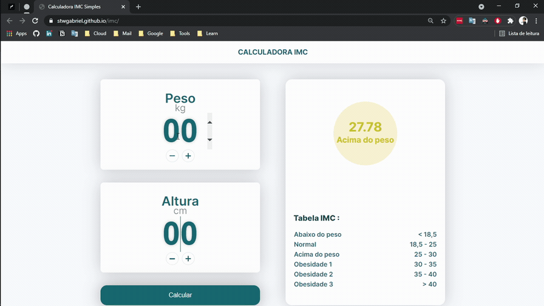

# Calculadora de imc

Para visualizar os arquivos do projeto faça o download dos arquivos 
 
ou execute `git clone https://github.com/StwGabriel/imc.git` em um terminal git bash ou outro de sua preferencia

### Veja em : [live preview](https://stwgabriel.github.io/basic-js-projects/imc/)
### Versão desktop

### Versão Mobile

## Descrição

Calculadora simples de IMC (Índice de Massa Corpórea) desenvolvida em HTML, CSS e JS.

### linguagens e ferramentas utilizadas

   
   
   
   

## Social & Profissional

   
   
   
   
   

[Link Tree](https://cutt.ly/stwgabriel)
